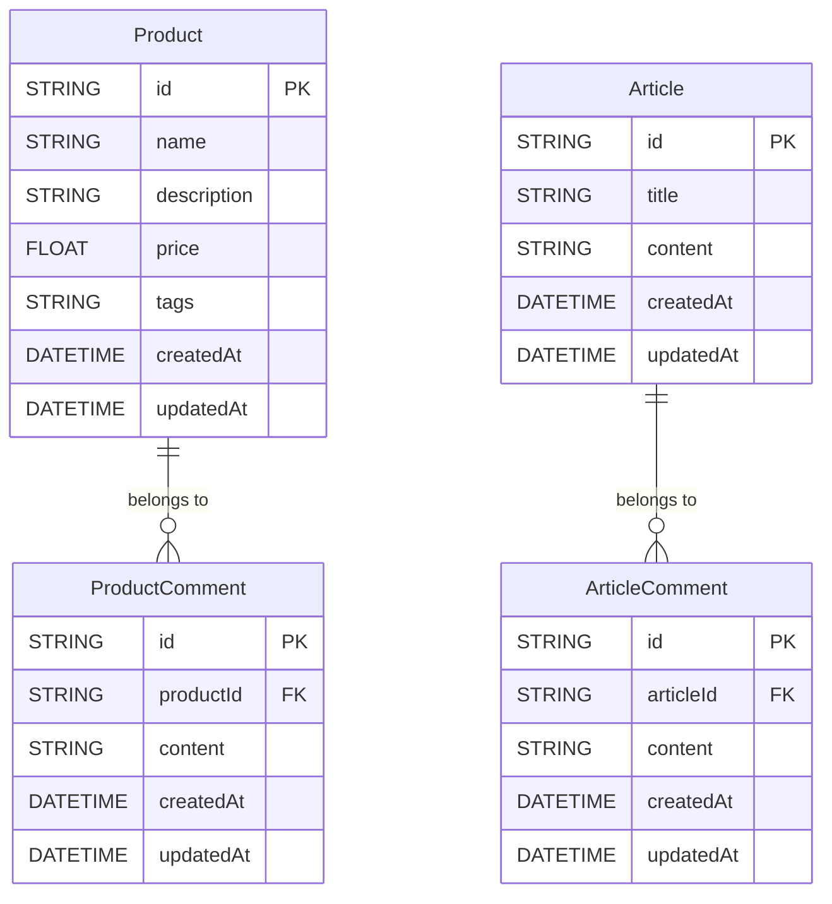

# Product, Article, Comment

```mermaid
  erDiagram
    Product {
        STRING id PK
        STRING name
        STRING description
        FLOAT price
        STRING tags
        DATETIME createdAt
        DATETIME updatedAt
    }

    Article {
        STRING id PK
        STRING title
        STRING content
        DATETIME createdAt
        DATETIME updatedAt
    }

    ProductComment {
        STRING id PK
        STRING productId FK
        STRING content
        DATETIME createdAt
        DATETIME updatedAt
    }

    ArticleComment {
        STRING id PK
        STRING articleId FK
        STRING content
        DATETIME createdAt
        DATETIME updatedAt
    }

    Product ||--o{ ProductComment : "belongs to"
    Article ||--o{ ArticleComment : "belongs to"
```
